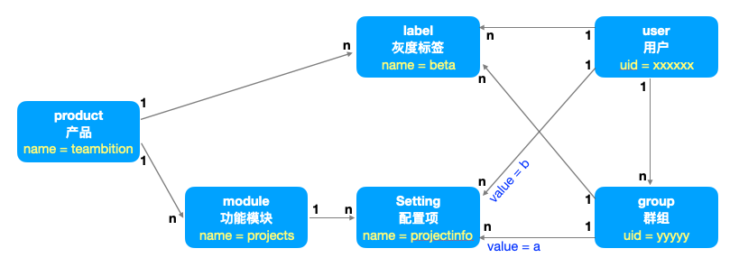

# Urbs-Setting 名词概念

## user 用户
灰度系统的用户，仅以 uid 标记，uid 必须系统内唯一，实体来自于外部系统，如 Teambition 的 User。

## group 群组
灰度系统的群组，仅以 uid 和 kind 标记，uid 必须系统内唯一，实体来自于外部系统，如 Teambition 的 Organization、Project 等。
群组可以添加成员，可以被指派标签，可以被指派功能配置项。
被指派的标签和被指派功能配置项都会被群组成员继承。

## product 产品
灰度系统的产品，仅以 name 标记，name 必须系统内唯一，主要用于灰度配置隔离。比如一个灰度系统中可以包含 teambition、thoughts 等不同产品，每个产品有自己的灰度配置策略。

## module 功能模块
灰度系统产品下的功能模块，仅以 name 标记，name 在同一个产品下必须唯一。

## setting 配置项
**配置项一般用于客户端功能模块的 A/B 测试（或功能降级），也可用于服务端功能模块的 A/B 测试（或功能降级）**
灰度系统产品下的功能模块配置项，又称 **功能开关**，仅以 name 标记，指派给用户或群组时应该设置配置值 value，name 在同一个功能模块下必须唯一。
客户端读取指定 uid 用户在指定 product 下的功能模块配置项列表，根据其值决定对应功能模块配置是否开启或开启不同状态。

## label 环境标签
**环境标签用于后端服务的灰度。**
灰度系统的环境标签，仅以 name 标记，name 在同一个产品下。
后端网关会根据当前用户的环境标签，决定请求进入不同环境标签的服务。
